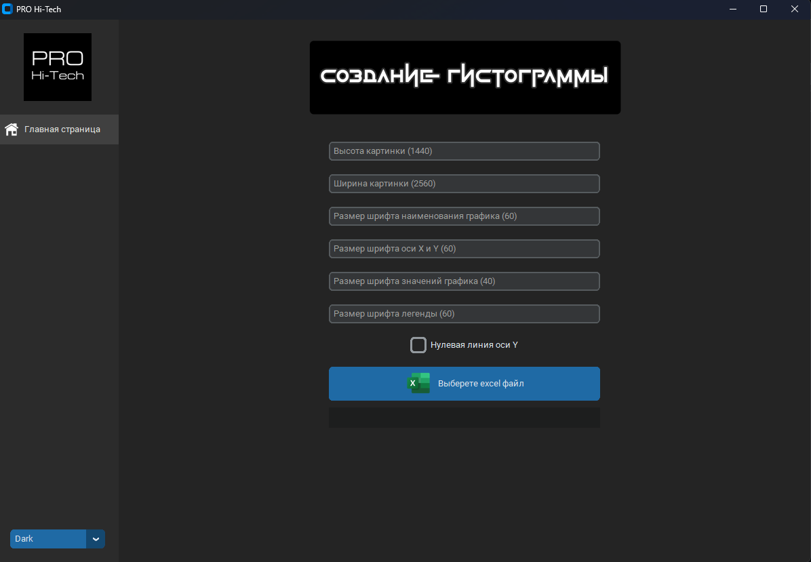
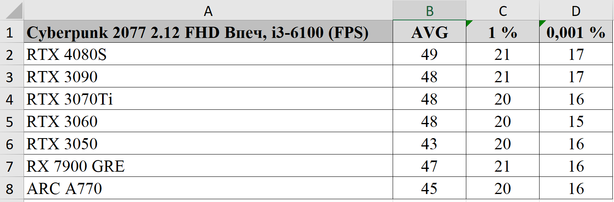
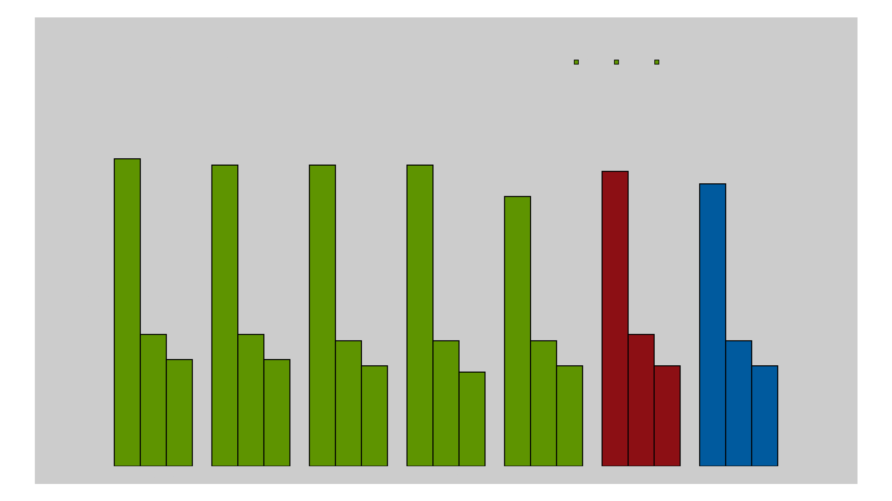

# Desktop приложение формирование гистограмм PRO Hi-Tech

Приложение парсит переданный excel файл с данными проведённых тестов 
и формирует гистограмму в формате png по стилю youtube канала PRO Hi-Tech.
При построении гистограммы учитывается наименование бренда участника теста (AMD, Nvidia, Intel), 
для указания цвета бренда на изображении.

### Инструкция
 - настраиваем размер изображений и шрифтов, если значения по умолчанию не подходят
 - выбираем excel файл с тестовыми данными
 - указываем папку, в которую будут сохранены все изображения
 - программа по каждому листу excel сформирует фрейм данных и построит на основании их гистограммы
 - наименование гистограммы и файла берётся с ячейки A1
 - гистограммы будут сохранены в папку, по указаному пути
 - по окончанию отработки, откроется папка с файлами

### Пример
Данные:

Результат:

### Запуск
Приложение можно запустить через модуль application.py или dist/application/application.exe

### Тестирование
Файл с тестовыми данными: test/Тестовые данные.xlsx
Примеры отработки тестового файла также находятся в папке test
